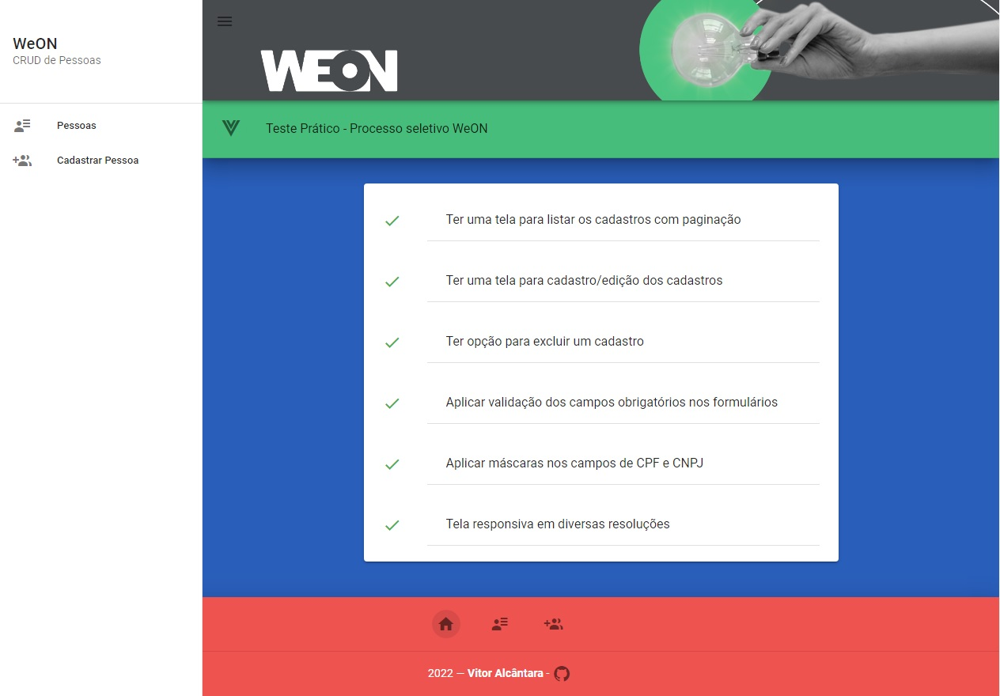

# weon-crud
### Teste Prático

<p align="center">
  
</p>

## Objetivos:

● Desenvolvimento de um CRUD de pessoa;✔✔

● Tentar utilizar a maior parte das tecnologias; ✔

● Mostrar domínio sobre criação e uso de componentes VueJS; ✔✔

● Ter uma tela para listar os cadastros com paginação; ✔✔

● Ter uma tela para cadastro/edição dos cadastros; ✔✔

● Ter opção para excluir um cadastro; ✔✔

● Aplicar validação dos campos obrigatórios nos formulários; ✔✔

● Aplicar máscaras nos campos de CPF e CNPJ; ✔✔

● Tela responsiva em diversas resoluções; ✔✔

## Funcionalidades do Sistema

● Update e delete
<p align="center">
  
</p>

● Formulário com validação de campos
<p align="center">
  
</p>

● Alternar tipo de cadastro e aplicação de máscara de CPF e CNPJ
<p align="center">
  
</p>

## Tecnologias a serem utilizadas:
● VueJS ✔✔

● Vue Router ✔✔

● Vuex ✔✔

● Git ✔✔

● Vuetify ✔✔

● SCSS (diferencial) ✔✔

● PWA (diferencial) ✔✔


## Project setup
```
- O Backend utiliza JasonBox. Para instalar é necessário ter uma instância do MongoDB rodando e dentro  da pasta jasonbox executar:
  -npm install (Para instalar as dependências do servidor)
  -npm start para rodar o servidor

```
- No Frontend basta executar:
  -npm install

### Compiles and hot-reloads for development
```
npm run serve
```

### Compiles and minifies for production
```
npm run build
```

### Customize configuration
See [Configuration Reference](https://cli.vuejs.org/config/).
